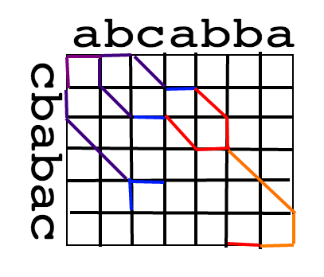

diff.js
=======

Overview
--------

[Simplest Demo][2].

> `diff` is a file comparison utility that outputs the differences between two
> files. It is typically used to show the changes between one version of a file
> and a former version of the same file. Diff displays the changes made per line
> for text files. Modern implementations also support binary files. The output
> is called a "diff", or a patch, since the output can be applied with the Unix
> program patch. The output of similar file comparison utilities are also called
> a "diff"; like the use of the word "grep" for describing the act of searching,
> the word diff is used in jargon as a verb for calculating any difference.
> -- <cite>[Wikipedia][0]</cite>

JavaScript implementation of reasonably fast `diff` algorithm. [Paper of Eugene
W. Mayers][1] was used a reference during implementation.

First version of algorithm will run in O(N+D^2) time complexity in general
cases, where D is the length of difference and N is the length of input. The
goal is to implement general-case fast algorithm with linear memory space usage.

The main application is comparing of text files, presumably source codes. But
the interface will be written in a very extensible way, so this implementation
would be easily applied to any comparable sequences.

Default behavior is comparison by lines, with extensibility these will be available:

- Comparison of texts, line by line
- Comparison of strings character by character
- Comparison of written plain text, word by word, sentence by sentence, etc
- Comparison of source code lexeme by lexeme
- ???
- PROFIT!!!

Eventual implementation would be running in linear space and O(NlgN+D^2) worst
time complexity using suffix tries. (At least I want to, I studied suffix tries
but never applied them).

MIT Licensed, Vyacheslav Kim.

[0]: http://en.wikipedia.org/wiki/Diff
[1]: http://www.xmailserver.org/diff2.pdf
[2]: http://rawgithub.com/Slava/diff.js/master/demo/byline.html

Internals
---------



So we work on edit graph grid. Our goal is to find a path from point (0,0) to
(N,M) with maximum number of diagonal moves. Each diagonal move means a matching
atom in a subsequence, each move to the straight right means adding an atom from
second sequence, move straight down means removing an atom from first sequence.

You can see, this problem is identical to Longest Common Subsequence and
Shortest Edit Script. Each is solvable with Dynamic Programming in square time
complexity but bottom-up DP tends to be slower then an optimized greedy solution
in general cases of file comparisons (users tend to compare similar files).

The idea is to build greedy paths with every iteration of "bad moves" for every
diagonal, from both sides: upper-left corner and bottom-right corner. We claim,
they will meet in half moves.

It is also the key to linear memory usage, but the same optimization could be
applied to bottom-up DP.

Testing
-------

You will need mocha.

```
npm install mocha
./run_tests.sh
```

Call for contributors
---------------------

The main part is done, we have base LCS algorithm which runs reasonably fast
and consumes linear amount of memory. Based on it, it is trivial to implement
`diff` and `patch`.

Next step could be implementation of utilities coming along with `diff`,
improving the performance of LCS-algorithm utilizing suffix tree or suffix array.

There is a lot of work which doesn't require strong knowledge of LCS algorithm,
such as packaging the code for node.js, Meteor, browserify and others. Making
sure code runs in all browsers in use (currently it relies on ES5 extentions).

Good demo page is needed! Since this implementation is general enough, we can run
diffs by lines, by words.
